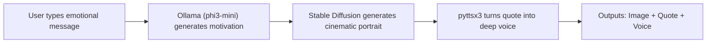

<!-- 🔥 Project Banner -->
<p align="center">
  
</p>

<h1 align="center"> AIMAN — Cinematic Motivational AI</h1>
<p align="center"><i>“Type your pain. Receive motivation.”</i></p>

<p align="center">
  <a href="https://github.com/Sourav-x-3202/aiman/stargazers">
    
  </a>
  <a href="https://github.com/Sourav-x-3202/aiman/issues">
    
  </a>
  
  
  
    <a href="https://codespaces.new/Sourav-x-3202/aiman">
    
  </a>
</p>


---

##  Table of Contents
- [ Demo](#demo)
- [ Screenshots](#screenshots)
- [ Overview](#overview)
- [ How It Works](#how-it-works)
- [ Key Features](#key-features---what-aiman-does)
- [ Tech Stack](#tech-stack)
- [ Installation](#installation)
- [ Usage](#usage)
- [ Folder Structure](#project-structure)
- [ Developer Notes](#developer-notes)
- [ Roadmap](#roadmap)
- [ Contribute](#contribute)
- [ Cinematic Design Philosophy](#cinematic-design-philosophy)
- [ License](#license)

---


##  Demo

| User Input | AI Generated Image + Cinematic Quote | AI Voice Output |
|------------|-------------------------------------|------------------|
| _"I lost my job as a graphic designer due to AI and now I'm nothing."_ |  |  [🎧 Play Voice](https://github.com/user-attachments/files/23434462/82b4b61cfdaaf5500b0b0f4c8f04549c3d30cfb9d4f3bf286b7fb134.wav) |

> Your message → AI motivation → Cinematic image → Spoken in voice.

---

## Screenshots
<p align="center">
  
  
</p>

---

##  Overview

**AIMAN** is a premium **offline cinematic motivational AI**.

You tell it what you're feeling — stress, failure, heartbreak —  
and it transforms your message into:

1. A motivational quote (generated by Local LLM — **Ollama phi3:mini**)
2. A cinematic portrait image (**Stable Diffusion v1.5**)
3. A deep, masculine **AI voice-over** (pyttsx3)

> Everything happens **locally**.  
> No internet. No APIs. No tracking.  
> Your emotions stay yours.

---

##  How It Works


---

##  Key Features - What AIMAN Does

| Feature | Description |
|---------|-------------|
|  Understands your emotions | Converts your message into motivational text using `phi3:mini` via **Ollama** |
|  Generates art | Creates cinematic portraits with **Stable Diffusion** |
|  Speaks to you | Deep voice using `pyttsx3` (offline) |
|  100% Local | No internet. No API keys. Privacy-first. |
|  Beautiful UI | Built in **Streamlit**, just click and use. |

---
##  Tech Stack

| Area | Tech |
|------|------|
| Web UI | Streamlit |
| LLM Text Generation | Ollama (`phi3:mini`) |
| Image Generation | Hugging Face Diffusers + Stable Diffusion |
| Voice / Speech | pyttsx3 (Offline TTS) |
| Utility | Pillow, Requests, Accelerate |

---
##  Installation
### 1. Clone Repo

```bash
git clone https://github.com/<your-username>/aiman.git
cd aiman
```

### 2. Create virtual environment

```bash
python -m venv venv
venv\Scripts\activate   # Windows
# or
source venv/bin/activate  # Mac/Linux
```

### 3. Install requirements

```bash
pip install -r requirements.txt
```

### 4. Start Ollama (Local LLM)

```bash
ollama serve
ollama pull phi3:mini
```

### 5. Run the app

```bash
streamlit run app.py
```
---

<details>
<summary>⚠️ Troubleshooting</summary>

### ❌ `ollama: command not found`
Install Ollama from: https://ollama.com/download  
Then restart your terminal.

---

### ❌ Model not found / Ollama shows no output
Run this manually once:

```bash
ollama pull phi3:mini
```
### ❌ GPU not detected (slow performance)
AIMAN will automatically switch to CPU mode.
No action needed.

### ❌ Text-to-speech not working (no voice)
On Windows:
1. Open Control Panel
2. Go to: `Speech Recognition → Text to Speech`
3. Select a male voice (`Guy / David / Microsoft`)

### ❌ `pip install -r requirements.txt` fails
Upgrade pip first:
```bash
python -m pip install --upgrade pip
```
If something still fails, install each dependency manually:
```bash
pip install streamlit diffusers pillow pyttsx3 accelerate
```
### Still stuck?

Create an issue here:
 https://github.com/Sourav-x-3202/aiman/issues

</details>


---

##  Usage

1. Open Streamlit UI
2. Enter your pain/frustration/goal
3. Click Generate Motivation
4. AIMAN creates:
   - Voice narration
   - Motivational message
   - Cinematic image

     
### Example (AI Motivation Generation)

```bash
text = "I feel lost and tired of failing."
```
   
---


## Project Structure

```bash
aiman/
│
├── app.py                   # Streamlit UI
├── generate_text.py         # AI motivational message generation
├── motivational_image.py    # Stable Diffusion cinematic image generation
├── text_to_speech.py        # Voice synthesis
├── requirements.txt         
├── README.md
├── assets/
│   └── fonts/               # Dancing Script font for overlay text
└── outputs/                 # Generated images + voice (auto-created)

```

##  Developer Notes

###  Quick Summary 
- Local LLM via **Ollama (phi3:mini)** → Generates motivational text  
- **Stable Diffusion v1.5** → Creates cinematic portraits  
- **Pillow + custom font** → Text overlay on image  
- **pyttsx3 (offline TTS)** → Deep masculine voice  
- Auto GPU/CPU fallback based on hardware  
- Outputs timestamp-named files inside `/outputs/`  
- No API keys, no cloud — 100% private  

---

<details><summary>Click to expand — Full Detailed Developer Notes</summary>

###  Motivation Engine (Local LLM)

- Uses `phi3:mini` LLM inside Ollama
- Fully offline — no API calls or internet dependency
- Custom prompting to maintain:
  - Cinematic tone (Godfather vibes)
  - Masculine mentorship voice
- Ensures messages are:
  - Short
  - Powerful
  - Emotionally supportive  
- Supports streaming so UI remains responsive

---

###  Stable Diffusion (Cinematic Portrait Generation)

- Model: `runwayml/stable-diffusion-v1-5`
- Uses `torch.float16` on GPU and `torch.float32` on CPU
- Image generation pipeline:
  - Text prompt → latent diffusion → decoding
- Applies cinematic prompt style:
  > warm golden light • dramatic shadows • film look
- Automatically saves images in:
`outputs/`

---

###  Typography Engine (Quote Overlay)

- Uses Pillow (`ImageDraw` + `ImageFont`)
- Auto-resizes text to fit image
- Intelligent line wrapping (prevents broken words)
- Adds soft drop shadow behind text
- Uses *Dancing Script Bold* font for elegance  
(fallback to Arial if font missing)

---

###  Text-to-Speech (Voice Generation)

- `pyttsx3` runs **offline** — no internet requirement
- Looks for male voice preferences:
- David
- Male
- Guy
- Parameters tuned for cinematic delivery:
- Speed: `rate = 145`
- Volume: `1.0`

---

###  UI Layer (Streamlit App)

- Real-time updates without page reload
- Sections:
- Input text
- Generated quote
- Generated image
- Play audio button

---

###  System Behavior

- Timestamp filenames:
```
outputs/
├── ai_image_2025-01-31_211023.png
├── ai_voice_2025-01-31_211023.wav
```
- No overwrites — every output is preserved
- `.gitignore` ensures:
- No output files pushed to GitHub
- No `.wav`, `.png`, `.mp3` leak

---

###  Error Handling & Fallback Logic

| Situation | AIMAN Response |
|----------|----------------|
| Ollama not running | `" AIMAN is offline"` |
| Quote generation failed | Uses backup motivational quote |
| Font not found | Uses system default font |
| GPU not detected | Automatic CPU mode |

---

### 🛠 Extensibility (Future)

- Export video reel (portrait + quote + voice)
- Use user's face as the cinematic output
- Add background music under voice narration

</details>

---

##  Roadmap

- Export video (image + voice) — like a motivational reel
- Add protagonists (your face → AI portrait)
- Voice emotion control (dominant, calm, intense)
---

## Contribute

PRs and feature requests are welcome.

- If you like this project, star the repo to support it:
- https://github.com/Sourav-x-3202/aiman

---
## Cinematic Design Philosophy

> “Emotion deserves presentation.”
> 
Like a motivational movie scene — every output should feel *powerful and personal*.
---

## Author

Developed by Sourav Sharma
If you like this project, please  star the repo — it motivates the developer 
 https://github.com/Sourav-x-3202/aiman

---

## License

MIT License — free to use, modify, and distribute.

<p align="center"><b>AIMAN</b><br><i>“Pain is input. Growth is output. AIMAN is the bridge.”</i></p>


